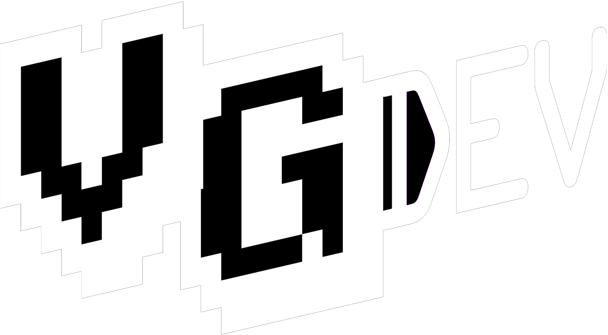

# UnityLib

This Repository holds various independent files VGDev has written while developing games.
Visit http://www.vgdev.org/ to see the games they were used in!

## Table of Contents:

### Backend Utility:
	Holds backend systems helpful in getting a game engine up and running quickly.

### General Scripting:
	Contains miscellaneous scripts that can be helpful in getting specfic features up and running quickly.

### Sound:
	Contains scripts that play and/or modify audio.

### UI:
	Contains scripts that interact with Unity's UI system.
